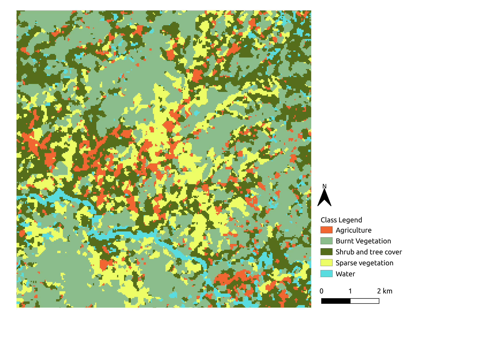

# mapme.classification 

<!-- badges: start -->

<!-- badges: end -->

## About MAPME

[MAPME](https://mapme-initiative.org/) is an initiative by [KfW](https://www.kfw.de/), 
[MapTailor Geospatial Consulting](https://maptailor.net/), and [Agence Française de Développement](https://www.afd.fr/) 
to provide free and open access to GIS tools and Earth observation 
in international development cooperation. MAPME is a community-driven initiative 
to jointly develop tools and solutions that help us to plan, monitor and evaluate 
our projects with the help of earth observation and Geographical Information Systems 
(GIS). MAPME repositories contain R codes that will allow you to generate various 
statistics on land use / land cover and vegetation trends to gain insights in your 
project area – these methods can – for example – be used to assess outcome indicators 
or to monitoring the progress in your projects. At the time being, the MAPME 
repositories encompass three main functionalities:	

-  Analyze, maps and quantify land use / land cover (LULC), such as change in forest cover or cropland (for forest cover via the <code> {[mapme.forest](https://github.com/mapme-initiative/mapme.forest)}</code> package)

-  vegetation productivity change and trend assessments, e.g. to map landscape degradation or rehabilitation via the <code> {[mapme.vegetation](https://github.com/mapme-initiative/mapme.vegetation)}</code> package

- Assessing agricultural productivity through the FAO WaPOR plattform via the <code> {[mapme.agriculture](https://github.com/mapme-initiative/mapme.agriculture)}</code> package

## About this package

`mapme.classification` is a R package that supports users to create land use / land 
cover (LULC) maps, based on the analysis of remote sensing data. 
This allows users – for example – to map the spatial distribution of forest or cropland and to assess the area of these land covers and how they change over time. It implements state of the art methods to assess the accuracy of the map and to quantify the LULC area, based on recognized FAO recommendations. It helps to 
establish spatial classification and regression models by offering functionality 
for robust model building. It plays nicely together with the 
`{mapme.vegetation}` package that can be used to create the required input for 
the LULC classification, i.e. it establishes a multi-temporal Sentinel-2 time-series 
of a user defined area of interest (AOI) as a basis for a classification or 
regression model established via `{mapme.classification}`

## Ressources

The tutorial for the usage of the 
<code>{[mapme.classification](https://github.com/mapme-initiative/mapme.classification)}</code>
can be found 
[here](https://mapme-initiative.github.io/mapme.classification). Please visit
this page in order to get to know the API of mapme.classification.
